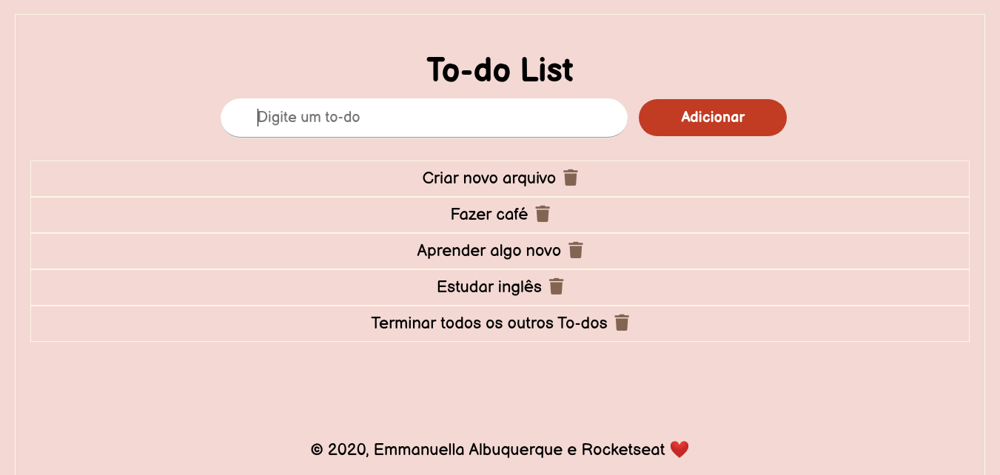

<table align="center"><tr><td align="center" width="9999">
 

 
To-do 

[Screens](#Screens)

#### To-do is an application that lists tasks.

</td></tr></table>

## About
The To-do project is an application to manage your tasks. 
The usage comes down to: adding a new task and removing it when it is finished.
Made with HTML5, CSS3, Javascript.
The same was developed during the studies of the starter course of Rocketseat. 🚀👩🏽‍🚀

## Technologies Used:
<ul>
  <li>  <strong> HTML5 </strong> </li>
  <li>  <strong> CSS3 </strong> </li>
  <li>  <strong> JavaScript </strong> </li>
</ul>

## Screens

* ### Client-side

Access the application: https://emmanuellaalbuquerque.github.io/to-do/

